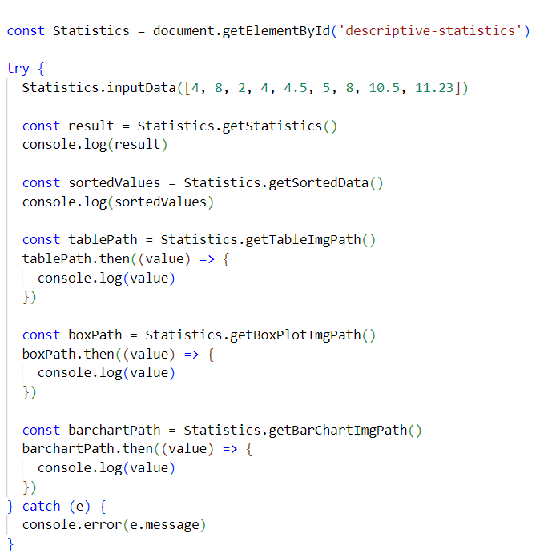

# Info to the user of the statistics-app

This is a Single-Page Application and a web application. If you have an amount of numbers and wish to process the data into descriptive statistics, this is the right application for you. Furthermore, this app returns diagrams like table diagram, bar chart and box-plot. The purpose of this app is to offer an overview of the submitted data through diagrams and descriptive statistics.

You should import the statistics-app component. When it is added to the DOM it will start with the "npm run dev" command. Follow the instructions in the web application, submit the data and then choose the different options for viewing descriptive statistics.

## statistics-app

This is a web application. The user can submit data and then choose an option for viewing the descriptive statistics of the data. 

## Start

Use the "npm i" command and then "npm run dev". 
You should now see something like this in the terminal:   
 Press the link to localhost and a window will open where you will see the following view: 

# Info to the user of the descriptive-statistics module

The descriptive-statistics module handles data input. The module returns the data's descriptive statistics like the average value, median, range, maximum value, etc. Furthermore, the module returns diagrams to add a visual representation of the data.

You should import the descriptive-statistics component/module. 
To access the different public methods you can do the following:   

There are six public methods which you can use:   

## inputData()

This method takes an array of numbers which represents the data set. The method doesn't return any information. 

## getSortedData()

This method returns the sent data array, now sorted from the lowest value to the highest.

## getStatistics()

Returns an object with several descriptive statistics (average, maximum, median, minimum,
mode, range and standard deviation) which have been derived from the data.

## getTableImgPath()

This method returns the path to the table image as a Promise.

## getBoxPlotImgPath()

This method returns the path to the boxplot image as a Promise.

## getBarChartImgPath()

This method returns the path to the bar chart image as a Promise.

