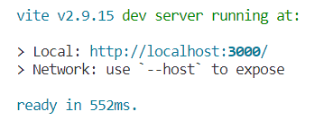
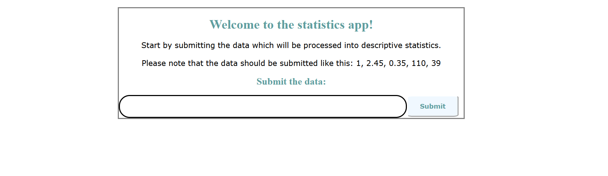

# Info to the user of the statistics-app

You should import the statistics-app component. When it is added to the DOM it will start with the "npm run dev" command. Follow the instructions in the web application, submit the data and then choose the different options for viewing descriptive statistics.

# Info to the user of the descriptive-statistics module

You should import the descriptive-statistics component/module. Then there are six public methods which you can use:   

## inputData()

This method takes an array of numbers which represents the data set. The method doesn't return any information. 

## getSortedData()

This method returns the sent data array, now sorted from the lowest value to the highest.

## getStatistics()

Returns an object with several descriptive statistics (average, maximum, median, minimum,
mode, range and standard deviation) which have been derived from the data.

## getTableImgPath()

This method returns the path to the table image as a Promise.

## getBoxPlotImgPath()

This method returns the path to the boxplot image as a Promise.

## getBarChartImgPath()

This method returns the path to the bar chart image as a Promise.

# statistics-app

This is a web application. The user can submit data and then choose an option for viewing the descriptive statistics. 

# Start

Use the "npm i" command and then "npm run dev". 
You should now see something like this in the terminal: 
 Press the link to localhost and a window will open where you will see the following view: 

# descriptive-statistics module

The assignment contains a web component module that handles data input. The module returns the data's descriptive statistics like the average value, median, range, maximum value, etc. Furthermore, the module returns diagrams to add a visual representation of the data. &lt;descriptive-statistics&gt; is an element which holds the &lt;lm-diagram&gt; element. The programmer can access the data module from within the main script file. The methods which are public from the index.js are listed here below. 

# Start

Use the "npm i" command. If debug is needed, write "npm run dev" and view the output of console.log() in the console. The main script file of the module can be found in  [start](./src/js/index.js). 

# Language

The language is english. 

# Dependencies

This module doesn't have any external libraries or dependencies. 

# Public methods

## inputData()

This method takes an array of numbers which represents the data set. The method doesn't return any information. 

## getSortedData()

This method returns the sent data array, now sorted from the lowest value to the highest.

## getStatistics()

Returns an object with several descriptive statistics (average, maximum, median, minimum,
mode, range and standard deviation) which have been derived from the data.

## getTableImgPath()

This method returns the path to the table image as a Promise.

## getBoxPlotImgPath()

This method returns the path to the boxplot image as a Promise.

## getBarChartImgPath()

This method returns the path to the bar chart image as a Promise.

