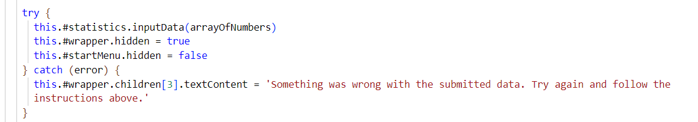
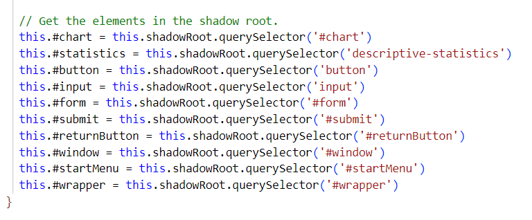

# Kapitel 2
Kapitlet fokuserar på namngivning av metoder och variabler. Jag har verkligen försökt att tänka på att skapa meningsfull namngivning. Namnet ska tillföra info till andra programmerare och på så sätt göra det enkelt att sätta sig in i koden. Jag har också tänkt mycket på att namnen inte är missvisande, utan verkligen reflekterar vad metoden gör. Därför har jag brutit ut funktionaliteten toDataURL() från draw-metoderna för att inte skapa sidoeffekter. .

# Kapitel 3
Ett viktigt budskap i det här kapitlet är att en funktion ska fokusera på att göra en sak. Jag utgår ofta från den här regeln och det har påverkat min kod till det bättre. Om funktionen gör mer än en sak så brukar jag dela upp den i fler funktioner. På så sätt kan jag se till att varje metod får en uppgift att utföra. I funktionen inputData() fanns mer än en uppgift och därför har jag nu lagt till funktionen checkInput(). .

# Kapitel 4
Efter att ha läst det här kapitlet har jag försökt att ta bort så många onödiga kommentarer som möjligt. Istället har jag ändrat i koden för att tydliggöra vad jag menar. Som författaren skriver finns det slutgiltiga svaret om vad koden gör i själva koden. Det är därför bättre att förbättra koden än att täcka upp för sämre kod med kommentarer. Jag valde dock att behålla JSDOC-kommentarerna just eftersom jag skriver i JavaScript. Jag tror att de kan tillföra viktig info. Jag försökte också vara noga med att hålla dem uppdaterade. .

# Kapitel 5
Jag tar till mig regeln som säger att man bör lista metoder i rätt vertikal ordning. En funktion som anropas av en annan funktion bör finnas nedanför funktionen som anropar den. På så sätt blir det ett naturligt flöde av metoder som förbättrar läsbarheten. I boken beskrivs det som att man går från en högre abstraktionsnivå till en lägre.  .

# Kapitel 6
Jag kommer att lägga på minnet betydelsen av att uttrycka sin data i abstrakta termer i de fall man vill skydda datan. Det är alltså viktigt att tänka på i vilka fall man bör lägga till getters och setters och i vilka fall man inte bör göra det. I mitt projekt har jag därför försökt att begränsa antalet publika metoder. Här är ett exempel på en privat metod .

# Kapitel 7
Jag känner igen mig i exemplet om att returnera en textsträng istället för att kasta ett fel, så det här kapitlet var viktigt läsning. Ibland tar man till vad som verkar som en enkel lösning men som egentligen gör koden mer komplicerad i längden. Jag har därför använt mig mer av try/catch den här gången. .

# Kapitel 8
Jag har inte ändrat något i min kod efter att ha läst det här kapitlet. Jag var medveten sedan tidigare om att exempelvis Maps och ArrayList inte bör skickas runt i systemet. Jag håller exempelvis ArrayList inom klassen/komponenten där den används. För övrigt var det intressant att läsa om att man kan skriva tester för att sätta sig in i någon annans kod och försöka förstå hur den fungerar. .

# Kapitel 9
Det här kapitlets innehåll kändes bekant efter tidigare arbete med testning. Att enhetstester ska skrivas innan själva koden som ska testas kände jag till. Jag har inte ändrat något i min kod efter läsningen, men jag tar med mig begreppet "clean tests" och råden kring vad man ska tänka på.  
.

# Kapitel 10
Jag tycker om den tydliga beskrivningen när det kommer till att organisera klasser. Jag har försökt att följa råd som: att det sällan är en bra idé att ha publika variabler och att man ska försöka begränsa antalet uppgifter för en klass. På så sätt kan jag undvika att klasserna blir för stora. .

# Kapitel 11
"Separation of concerns" är ett begrepp som är centralt för det här kapitlet. Det är intressant att läsa att arkitekturen för ett system kan växa allteftersom om vi separerar ansvarsområden från varandra. Jag tänker att det är därför som min kod har kunnat utvecklas. Jag har organiserat modulerna/komponenterna så att de har ansvar för olika saker, vilket har gjort det möjligt att lägga till ny funktionalitet. .

