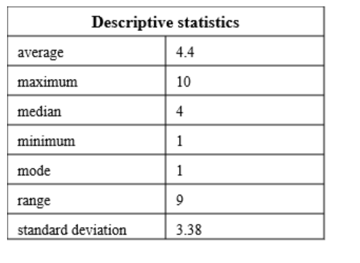
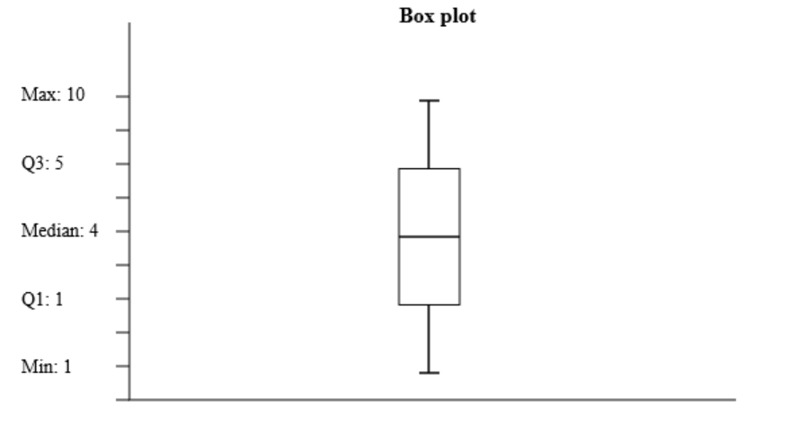
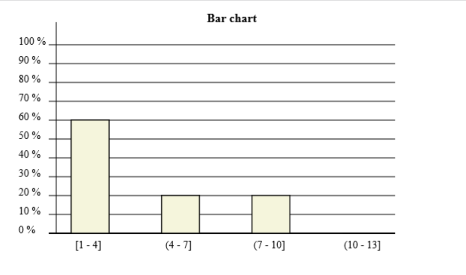

# Testrapport

Testningen utförs manuellt. Jag testar samtliga publika metoder med bestämda indata och förväntad utdata. Vid testningstillfället fungerar samtliga publika metoder som det är tänkt. Testningen utförs i komponenten test-app [test-app](./src/js/components/test-app/test-app.js). För att köra applikationen, skriv in "npm run dev" och används sedan Inspektera-funktionen i webbfönstret. I den konsolen kan man läsa utskrifterna och på webbsidan kan man se diagrammen. I test-app komponenten kan man anropa de olika testen under connectedCallback(). 

| Test            | Metod          | Resultat                             | 
| --------------- | -------------- | ------------------------------------ |
| testErrorMessage(), Felmeddelande visas när en array utan värden matas in    |  I testets funktion anropas inputData([])           |     I konsolen kan man läsa "The passed array contains no elements."                                 |
| testStatisticsSummary(), getStatistics() returnerar ett objekt där vi kontrollerar att värdena stämmer för en bestämd array med värden       |   I testets funktion anropas inputData([1, 10, 6, 2, 4, 10]) och sedan getStatistics()        |     Utskriften i konsolen ska visa på ett objekt där average är 5.5, maximum 10, median 5, minimum 1, mode value 10, range 9 och standard deviation 3.547299442298794.                 |
| testSortData(), getSortedData() returnerar en array med sorterade värden från en inmatad array med bestämda värden      |   I testets funktion anropas inputData([-10, 1, 6, 0]) och sedan getSortedData()          |  Utskriften i konsolen ska visa på arrayen [ -10, 0, 1, 6 ]     |              |                                      |
| testPath(), getTableImgPath() ska returnera ett Promise som vi kan omvandla till en textsträng     |   Först anropas inputData([4, 1, 1, 6, 10]) i testets funktion. Sedan anropas getTableImgPath() och vi gör en resolve på promise:t och skriver ut värdet i konsolen      |  I konsolen skrivs en lång textsträng ut. Den är för lång för att skriva ut här, men den börjar med "data:image/png;base64"          |
| testShowTable(), Vi kan visa den ritade tabellen i ett img-element     |  Först anropas inputData([4, 1, 1, 6, 10]) i testets funktion. Sedan anropas getTableImgPath() och textsträngen får sedan bli src till image-elementet            |   I webbfönstret kan man nu se tabellen. Den ska överensstämma med bilden .       |
| testShowBoxplot(), Vi kan visa den ritade boxplot:en i ett img-element    |    Först anropas inputData([4, 1, 1, 6, 10]) i testets funktion. Sedan anropas getBoxPlotImgPath() och textsträngen får sedan bli src till image-elementet               |      I webbfönstret kan man nu se låddiagrammet. Det ska överensstämma med bilden .                      |
| testShowBarchart(), Vi kan visa det ritade stapeldiagrammet i ett img-element    |    Först anropas inputData([4, 1, 1, 6, 10]) i testets funktion. Sedan anropas getBarChartImgPath() och textsträngen får sedan bli src till image-elementet               |     I webbfönstret kan man nu se stapeldiagrammet. Det ska överensstämma med bilden .               |

