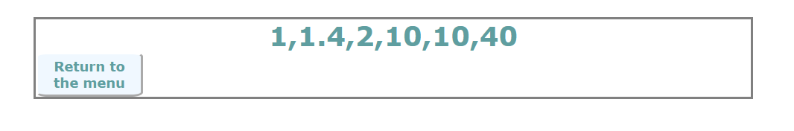

# Testrapport för appen

Testningen utförs manuellt via appens gränssnitt. Testerna utgår ifrån bestämda indata och förväntad utdata. Vid testningstillfället får samtliga tester godkänt. För att köra applikationen, skriv in "npm run dev" och använd sedan gränssnittet för testningen. 

| Test            | Metod          | Resultat                             | Krav       |
| --------------- | -------------- | ------------------------------------ |------------|
| testSubmitData, Användaren ska kunna skicka in data med hjälp av input-fältet och submit-knappen.    |  Användaren skriver in 1, 2.45, 1.5, 10 och trycker sedan på submit-knappen          |     På webbsidan visas nu vyn   |   1. Det ska finnas ett input-fält där användaren kan skriva in datan och sedan trycka på en knapp för att skicka in datan.                               |
| testErrorSubmitDataAsString, Användaren meddelas om den inskickade datan innehåller en textsträng    |   Användaren skriver in 1, dag, 40, 10 och trycker sedan på submit-knappen        |     På webbsidan visas nu vyn                 |  1. Det ska finnas ett input-fält där användaren kan skriva in datan och sedan trycka på en knapp för att skicka in datan.   |
| testViewFourOptions, Efter att ha skickat in data ska användaren få möjlighet att välja mellan fyra alternativ   |   Användaren skriver in 1, 1.4, 40, 10, 2, 10 och trycker sedan på submit-knappen        |     På webbsidan visas nu vyn                 |  2. Användaren ska sedan kunna välja mellan fyra alternativ.  |
| testOptionSortData, Efter att ha skickat in data och valt det första alternativet ska användaren få tillbaka datan sorterad från lägsta till högsta värdet.   |   Användaren skriver in 1, 1.4, 40, 10, 2, 10 och trycker sedan på submit-knappen. Därefter väljs alternativet "Get the data sorted from the lowest to the highest value" och användaren trycker på submit-knappen.       |     På webbsidan visas nu vyn                 |  3. Det första alternativet är att få tillbaka datan, nu sorterad från lägsta till högsta värdet|
| testOptionSortDataForNumbersBelowZero, Efter att ha skickat in data och valt det första alternativet ska användaren få tillbaka datan sorterad från lägsta till högsta värdet.   |   Användaren skriver in 1, 1.4, -4, 10, -2, 10 och trycker sedan på submit-knappen. Därefter väljs alternativet "Get the data sorted from the lowest to the highest value" och användaren trycker på submit-knappen.       |     På webbsidan visas nu vyn                 |  3. Det första alternativet är att få tillbaka datan, nu sorterad från lägsta till högsta värdet|
| testOptionTable, Efter att ha skickat in data och valt det andra alternativet ska användaren få tillbaka en tabell med den deskriptiva statistiken.   |   Användaren skriver in 1.2, 1, 120, 11, 1.89 och trycker sedan på submit-knappen. Därefter väljs alternativet "Get a table of the descriptive statistics" och användaren trycker på submit-knappen.       |     På webbsidan visas nu vyn                 |  4. Det andra alternativet är att få tillbaka en tabell med den deskriptiva statistiken |
| testOptionBoxPlot, Efter att ha skickat in data och valt det tredje alternativet ska användaren få tillbaka ett histogram.   |   Användaren skriver in 1.2, 1, 120, 11, 1.89, 11 och trycker sedan på submit-knappen. Därefter väljs alternativet "Get a box-plot of the descriptive statistics" och användaren trycker på submit-knappen.       |     På webbsidan visas nu vyn                 |  5. Det tredje alternativet är att få tillbaka ett histogram |
| testOptionBarChart, Efter att ha skickat in data och valt det fjärde alternativet ska användaren få tillbaka ett stolpdiagram.   |   Användaren skriver in 1.2, 1, 120, 11, 1.89, 11 och trycker sedan på submit-knappen. Därefter väljs alternativet "Get a bar chart of the descriptive statistics" och användaren trycker på submit-knappen.       |     På webbsidan visas nu vyn                 |  6. Det fjärde alternativet är att få tillbaka ett stolpdiagram |
| testReturnButtonInSortDataView, Efter att ha valt det första alternativet och skickats till vyn ska användaren kunna trycka på knappen "Return to the menu" och komma tillbaka till menyn med de olika alternativen |   Användaren skriver in 1, 1.4, 40, 10, 2, 10 och trycker sedan på submit-knappen. Därefter väljs alternativet "Get the data sorted from the lowest to the highest value" och användaren trycker på submit-knappen. Sedan trycker användaren på "Return to the menu"-knappen.      |     På webbsidan visas nu vyn                |  7. Efter att användaren har valt ett alternativ ska det finnas möjlighet att gå tillbaka och välja ett nytt alternativ |
| testReturnButtonInTableView, Efter att ha valt det andra alternativet och skickats till vyn ska användaren kunna trycka på knappen "Return to the menu" och komma tillbaka till menyn med de olika alternativen |   Användaren skriver in 1, 1.4, 40, 10, 2, 10 och trycker sedan på submit-knappen. Därefter väljs alternativet "Get a table of the descriptive statistics" och användaren trycker på submit-knappen. Sedan trycker användaren på "Return to the menu"-knappen.      |     På webbsidan visas nu vyn                |  7. Efter att användaren har valt ett alternativ ska det finnas möjlighet att gå tillbaka och välja ett nytt alternativ |
| testNewOptionAfterReturnButton, Efter att ha valt det tredje alternativet och skickats till vyn ska användaren trycka på knappen "Return to the menu". I menyn väljs det fjärde alternativet som ett nytt alternativ. |   Användaren skriver in 1, 1.4, 40, 10, 2, 10 och trycker sedan på submit-knappen. Därefter väljs alternativet "Get a box-plot of the descriptive statistics" och användaren trycker på submit-knappen. Sedan trycker användaren på "Return to the menu"-knappen. Användaren väljer nu alternativet "Get a bar chart of the descriptive statistics"       |     På webbsidan visas nu vyn                |  7. Efter att användaren har valt ett alternativ ska det finnas möjlighet att gå tillbaka och välja ett nytt alternativ |

# Testrapport för modulen

Testningen utförs manuellt. Jag testar samtliga publika metoder med bestämda indata och förväntad utdata. Vid testningstillfället fungerar samtliga publika metoder som det är tänkt. Testningen utförs i komponenten test-app [test-app](./src/js/components/test-app/test-app.js). För att köra applikationen, skriv in "npm run dev" och används sedan Inspektera-funktionen i webbfönstret. I den konsolen kan man läsa utskrifterna och på webbsidan kan man se diagrammen. I test-app komponenten kan man anropa de olika testen under connectedCallback(). 

| Test            | Metod          | Resultat                             | 
| --------------- | -------------- | ------------------------------------ |
| testErrorMessage(), Felmeddelande visas när en array utan värden matas in    |  I testets funktion anropas inputData([])           |     I konsolen kan man läsa "The passed array contains no elements."                                 |
| testStatisticsSummary(), getStatistics() returnerar ett objekt där vi kontrollerar att värdena stämmer för en bestämd array med värden       |   I testets funktion anropas inputData([1, 10, 6, 2, 4, 10]) och sedan getStatistics()        |     Utskriften i konsolen ska visa på ett objekt där average är 5.5, maximum 10, median 5, minimum 1, mode value 10, range 9 och standard deviation 3.547299442298794.                 |
| testSortData(), getSortedData() returnerar en array med sorterade värden från en inmatad array med bestämda värden      |   I testets funktion anropas inputData([-10, 1, 6, 0]) och sedan getSortedData()          |  Utskriften i konsolen ska visa på arrayen [ -10, 0, 1, 6 ]     |              |                                      |
| testPath(), getTableImgPath() ska returnera ett Promise som vi kan omvandla till en textsträng     |   Först anropas inputData([4, 1, 1, 6, 10]) i testets funktion. Sedan anropas getTableImgPath() och vi gör en resolve på promise:t och skriver ut värdet i konsolen      |  I konsolen skrivs en lång textsträng ut. Den är för lång för att skriva ut här, men den börjar med "data:image/png;base64"          |
| testShowTable(), Vi kan visa den ritade tabellen i ett img-element     |  Först anropas inputData([4, 1, 1, 6, 10]) i testets funktion. Sedan anropas getTableImgPath() och textsträngen får sedan bli src till image-elementet            |   I webbfönstret kan man nu se tabellen. Den ska överensstämma med bilden .       |
| testShowBoxplot(), Vi kan visa den ritade boxplot:en i ett img-element    |    Först anropas inputData([4, 1, 1, 6, 10]) i testets funktion. Sedan anropas getBoxPlotImgPath() och textsträngen får sedan bli src till image-elementet               |      I webbfönstret kan man nu se låddiagrammet. Det ska överensstämma med bilden .                      |
| testShowBarchart(), Vi kan visa det ritade stapeldiagrammet i ett img-element    |    Först anropas inputData([4, 1, 1, 6, 10]) i testets funktion. Sedan anropas getBarChartImgPath() och textsträngen får sedan bli src till image-elementet               |     I webbfönstret kan man nu se stapeldiagrammet. Det ska överensstämma med bilden .               |

